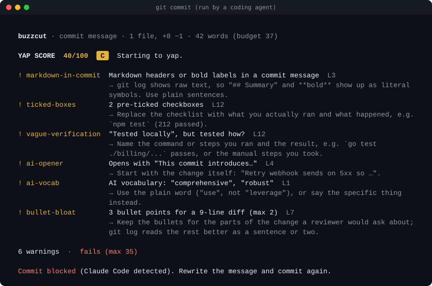
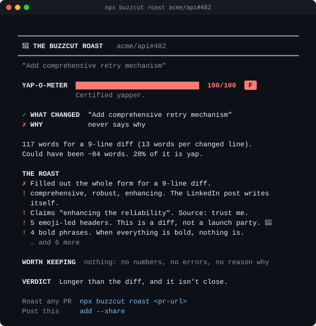
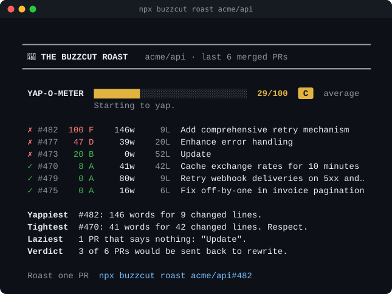

<div align="center">

# buzzcut

**AI yaps, we cut. Pull requests written like the good old days.**

Your agent writes the code. buzzcut makes the commit messages and PR descriptions it writes say what changed and why, in plain words, so your reviewers read the PR itself instead of pasting it into another AI to find out what it does. Each draft is checked before it runs: the names, files and test counts it cites are looked up in the diff, the repo and the agent's session, and when it's a form, a file tour or padding, the agent is told exactly what to cut and rewrites it. You don't do anything.

No API key and zero dependencies. The checks are deterministic: no model is called (the GitHub Action has an optional AI check that is off by default). Works in Claude Code, Cursor, Windsurf, Antigravity, VS Code and the terminal.

[](https://www.npmjs.com/package/buzzcut)
[](https://github.com/Shiva-Xs/buzzcut/actions/workflows/ci.yml)
[](LICENSE)



</div>

## Why

Senior engineers keep saying it: AI-written PRs are hard to read. `## Summary / ## Changes / ## Testing` on a 9-line fix, a bold label on every bullet, a tour of files the diff already shows, boxes ticked for tests nobody ran. So reviewers paste the PR into another AI to find out what changed.

In 1,275 real PRs opened by coding agents in 2026, 20% never said why ([bench/](bench)). We're not going to stop coding with AI, so buzzcut makes what it writes read like a good engineer's PR from before AI: what changed and why, the few changes a reviewer would ask about, and what was run, if anything was. Not squeezed into one paragraph, not a form.

## Install once

```bash
npm i -g buzzcut
buzzcut setup
```

`setup` covers the whole machine: a global `commit-msg` and `pre-push` hook for every repo (each repo's own hooks keep working), the buzzcut skill and pre-command hook for every coding agent it finds, and VS Code's ✨ commit and PR buttons. `buzzcut doctor` shows what's installed; `buzzcut setup --uninstall` puts everything back.

| Where | How buzzcut steps in | Tested with the real app |
|---|---|---|
| Claude Code (terminal and VS Code extension) | Skill + PreToolUse hook + git hooks | ✅ 0.3: five live sessions blocked a lazy commit and bloated PRs, and the agent rewrote and committed; PRs through `gh` and a GitHub MCP connector |
| Antigravity | Skill + PreToolUse hook + git hooks | ✅ (checked on 0.1) Blocked `"Update webhook.js"`; the agent rewrote and committed |
| Cursor | Skill + beforeShellExecution hook + git hooks | ✅ (checked on 0.1) Blocked `"Update webhook.js"`; the agent rewrote and committed |
| Windsurf | Skill + pre_run_command hook + git hooks | ✅ (checked on 0.1) Blocked `"Update webhook.js"`; the agent rewrote and committed |
| VS Code (Copilot agent, ✨ buttons) | Skill + agent hook + button instructions + git hooks | Built to VS Code's documented format |
| Codex, Gemini CLI, others | Skill + git hooks | |
| Any terminal, any person | Git hooks (warn only) | ✅ End-to-end tests with real `git commit` and `git push` |

For a whole team instead, `npm i -D buzzcut && npx buzzcut init` writes the same hooks and skill into the repo, to commit and share. Nobody gets locked out if they don't have it.

Only want the skill? `npx skills add Shiva-Xs/buzzcut`. In Claude Code, the plugin brings the skill and the hook: `/plugin marketplace add Shiva-Xs/buzzcut`, then `/plugin install buzzcut@buzzcut`.

## How it works

You say "push this and open a PR". The agent loads the buzzcut skill and runs `buzzcut context`, which maps the diff (areas, line counts, tests, generated files, the branch's commits), gives the shape and length for a diff that size, and says how this repo writes commits. It writes the message and runs `git commit` or `gh pr create`; its pre-command hook hands the text to buzzcut **before the command runs**. Anything a reviewer would struggle with is sent back with the exact fixes, and the agent rewrites it. Git's own hooks check again, which covers every editor, the ✨ button and an agent's `--no-verify`. You don't do anything.

Coding agents are sent back; people only ever get a warning (change that with `"block"` in the config).

**Sent back:** claims the diff or the session contradicts ("added unit tests" with no test file changed, "tests pass" when nothing ran, a test count that isn't what the run printed), subjects that say nothing ("fix bug", "Update webhook.js"), a Summary / Changes / Testing form on a small diff, a commit body that lists every change, extreme bloat, and a rewrite that drops facts (numbers, errors, links, `file:line`).

**Notes, not blocks:** a name, file or figure it can't find in the diff, the repo before the change, or the session; "adds X" about something the diff removes; an area holding 40% or more of the changed lines that the description never mentions. The agent gets them as advice; make the name check block with `"rules": {"unsourced-name": "error"}`. See the [CHANGELOG](CHANGELOG.md) for what changed in each release.

**Advice only:** a bit long, a few extra bullets, a buzzword, no reason given. buzzcut cuts fluff, never facts: a long PR full of facts is never sent back for its length. Every rule, the yap score and the word budget are in [docs/how-it-works.md](docs/how-it-works.md).

## Before and after

The same 9-line change: retry webhook deliveries to customer endpoints on 5xx and 429. The after is the shape buzzcut asks for: what changed and why, the changes a reviewer would ask about, and what was tested.

<table>
<tr><th>Before: 146 words, yap score 100 (F)</th><th>After: 80 words, yap score 0 (A)</th></tr>
<tr valign="top"><td>

```md
## 🚀 Summary
This PR introduces a comprehensive and
robust retry mechanism for webhook
delivery, significantly enhancing the
reliability and resilience of our
notification system.

## ✨ Key Changes
- **Retry Logic**: Implemented a robust
  retry loop in `src/webhook.ts`...
- **Exponential Backoff**: Leveraged...
- **Code Quality**: Improved code
  readability and maintainability

## 🧪 Testing
- [x] Tested locally
- [x] No breaking changes

Overall, these changes significantly
improve the robustness of our webhook
delivery pipeline...
```

</td><td>

```md
Retry webhook deliveries on 5xx and 429

Webhook deliveries to customer
endpoints fail about 2% of the time
with 502s and 503s while their
servers restart, and we drop the
event. This retries them.

- 5xx and 429 responses retry up to
  3 times with backoff (200ms, 400ms,
  800ms, plus up to 100ms of jitter),
  then throw so the job queue picks
  the event up
- Other 4xx responses still fail
  right away, since retrying won't
  help

Tested: `npm test`, plus a local
server that returns 503 twice, then
200.
```

</td></tr>
</table>

## Roast any PR, any repo, or your own history

```bash
npx buzzcut roast https://github.com/owner/repo/pull/123   # one PR, as a card
npx buzzcut roast owner/repo                               # its last 10 merged PRs, ranked
npx buzzcut roast                                          # inside a repo: its last 20 commits
```

Or with no install at all, in your browser: **[trybuzzcut.pages.dev](https://trybuzzcut.pages.dev)**. It runs the same checks locally in the page, against GitHub's public API.



Every card starts with what a reviewer asks: does it say **what changed** (the title), and **why** (the sentence that gives a reason)? Then it cuts in proportion: a clean PR gets a compliment, a decent one a nit or two, a yappy one the full roast, backed by numbers (words per changed line, how far over budget). **Worth keeping** pulls out the sentences that carry facts, which is what a short version would say. Add `--share` for a link that posts the roast on X, or `--md` for a comment.



No author names on any card, and PRs opened by bots are skipped.

## Config

Optional. `.buzzcut.json` at the repo root (or a `"buzzcut"` key in `package.json`):

```json
{
  "$schema": "https://unpkg.com/buzzcut/schema.json",
  "max": 35,
  "block": "agents",
  "length": "normal",
  "rules": { "em-dash": "off", "length": "error" },
  "ignore": ["^release:"]
}
```

| Key | Default | Meaning |
|---|---|---|
| `max` | `35` | Highest passing yap score |
| `block` | `"agents"` | Who a failing message blocks: `"agents"` (people get a warning), `"always"`, or `"never"` (advice only) |
| `length` | `"normal"` | How long descriptions should be: `"short"` (0.6× the words and bullets), `"normal"`, or `"detailed"` (1.6×). `buzzcut context` passes it to the agent, so it writes to that length the first time. The checks for false claims and dropped facts are the same at every length |
| `rules` | `{}` | Per rule: `"off"`, `"info"`, `"warn"` or `"error"` (for example `"unsourced-name": "error"` makes a name it can't find block) |
| `ignore` | `[]` | Regexes for subjects to skip, on top of the built-in ones |

A typo in a rule name is an error, not a silently ignored setting. A broken config never blocks a commit; buzzcut prints the problem and lets it through.

## GitHub Action

Catches PRs from people and agents that don't have buzzcut installed.

```yaml
# .github/workflows/buzzcut.yml
on:
  pull_request:
    types: [opened, edited, synchronize, reopened]
permissions:
  contents: read
  pull-requests: write
jobs:
  buzzcut:
    runs-on: ubuntu-latest
    steps:
      - uses: actions/checkout@v4
        with:
          fetch-depth: 0   # optional: lets it learn your commit style
      - uses: Shiva-Xs/buzzcut@v0
```

It checks the description and each commit (up to 30), writes a job summary, keeps one PR comment up to date, and fails the check when a coding agent's PR is blocked. A person's PR gets the comment and a warning; set `fail: always` to fail everyone or `fail: false` to never fail. A PR counts as an agent's when it comes from an agent's account (Copilot, Devin, Jules, Cursor, Codex…), carries an agent footer in its text, or has an agent trailer on a commit; dependency and release bots are skipped. Inputs: `max`, `comment`, `commits`, `fail`, `github-token`, and the optional `ai*` inputs below. Outputs: `score`, `grade`, `pass`. On fork PRs the token can't comment, so it warns and relies on the job summary.

**Optional AI check, off by default.** Set `ai: true` with `ai-provider` (`anthropic` or `gemini`), `ai-model` and `ai-api-key` (from a repository secret), and the Action also asks a model whether the diff supports the sentences that say what the code does. It is advice only and never fails the job, a finding has to quote the diff to count, and it sends the description and the diff to the provider you chose. Without a key it is skipped. It has not been measured against planted errors yet, so treat it as a second reader, not a guarantee.

## Does it work?

Tested on real PRs; the data and scripts are in [bench/](bench), so you can rerun all of it.

- **It leaves good writing alone.** On work from before AI coding tools (2018 to May 2021, 75 projects: kubernetes, rust, node, cpython, linux…), it sends back **0 of 167 commits** and **5 of 561 PRs**, all GitHub's default "Update README.md" titles. In total the checks ran on 3,366 real PRs and commits.
- **Agents write better PRs with it.** With the original skill (0.1), on 30 held-out real agent PRs, Sonnet 5 wrote buzzcut's version from each PR's diff, and a blind judge preferred it **30 of 30** times. It opened with what and why in 30 (originals 21) and was the right length in 30 (9). It was missing 11 facts a reviewer needs, against 67 in the originals.
- **Against a good plain prompt (0.3).** On 32 PRs from repos nobody had used, Gemini 3.8 Flash wrote each PR twice, once from a plain "keep the facts, add nothing" prompt and once with buzzcut; a blind grader ranked buzzcut's full tool above the plain prompt in 49 of 64 descriptions (the skill text alone in 57 of 64). The full tool keeps 90% of the author's facts against 87%, and still ranks a little below the skill text alone. One writer model, and notes taken from human PR text rather than a live agent session ([details](docs/how-it-works.md#writing-against-a-plain-prompt)).
- **Smaller models too.** With Gemini 3.8 Flash writing, all 30 pass, 29 say why (the 30th's author never gave a reason), and none keeps a bold label on every line or a file tour (7 and 4 of the originals did).

Not perfect: a fact check found a detail the diff contradicts in 8 of the 30 Sonnet PRs. The full evidence and its limits are in [docs/how-it-works.md](docs/how-it-works.md#the-evidence).

## What it can't do

- **It looks things up; it doesn't understand the code.** A wrong number ("adds 5" when it adds 1) or a wrong account of what the code does passes: on planted errors it caught 3 of 32 and 3 of 41. The skill has the agent reread those against the diff, and the optional AI check is the only part that reads meaning.
- **The writing evidence has limits.** It is one writer model (Gemini 3.8 Flash) working from human PR text, not a live agent session, with a grader of the same model family. The full tool ranks a little below the skill text alone ([the numbers](docs/how-it-works.md#writing-against-a-plain-prompt)).
- **It sends back agents, not people,** unless you change `block`.

## CLI

```
buzzcut setup [--no-git-hooks] [--no-agents] [--no-vscode] [--uninstall] [--dry-run]
buzzcut doctor
buzzcut init [--agents claude,cursor,windsurf,antigravity,copilot|all|none] [--uninstall]
buzzcut context [--kind pr] [--base <ref>] [--json]
buzzcut check [file|-]        A commit message against the staged diff
buzzcut pr [file|-]           A PR body against the branch (no file: the open PR, via gh)
buzzcut log [-n 10]           Score your recent commits
buzzcut roast <pr-url>        Roast any public GitHub PR (or owner/repo#123)
buzzcut roast <owner/repo>    Rank a repo's last merged PRs (-n 10)
buzzcut roast                 Inside a repo: rank its last commits (-n 20)
                               --share (post on X), --md, --json

check / pr options
  -m, --message <text>   --title <text>   --base <ref>   --rev <commit>
  --kind commit|pr       --no-diff        --max <n>      --json
```

`roast` and `pr` use `GITHUB_TOKEN`, or your `gh` login if you have one, only to call api.github.com.

## Use it as a library

```ts
import { analyze, prMessage, buildDiff, passes } from 'buzzcut';

const diff = buildDiff([{ path: 'src/webhook.ts', additions: 7, deletions: 2 }]);
const report = analyze(prMessage('Update webhook.ts', 'This PR introduces a robust retry mechanism for webhook delivery.'), diff);
report.score;        // 21
passes(report, 35);  // false: the title doesn't say what changed
report.findings;     // [{ rule: 'subject-vague', severity: 'error', … }, { rule: 'ai-opener', … }, { rule: 'ai-vocab', … }]
```

## FAQ

**Is this an AI detector?** No. It flags patterns, not authors. A person who writes "leverage" gets the same note as a model that does.

**Why no LLM?** A deterministic check is free, fast (tens of milliseconds per hook call), private, and gives the same answer every time, so it can gate commits and CI. Your coding agent is already a language model; what it lacked was something objective to check its writing against.

**What does it actually check against the diff?** That the names, files and test counts a description cites exist in the diff, the repo as it stood, or what the agent ran, and that "adds X" isn't about something the diff removes. A name it can't find is shown as a note, not a block. It can't tell whether what you say the code *does* is true, so the skill has the agent reread that part against the diff itself. On 62 invented names planted in real PRs it flagged 54, on 39 invented files 37, and on 32 wrong numbers or 41 wrong behaviors it caught 3 of each ([how it was measured](docs/how-it-works.md#checking-names-files-and-test-counts)).

**Does a PR have to say how it was tested?** No. Say what you ran and what it returned when you ran something; when you didn't, leave testing out instead of writing "Not tested". What buzzcut blocks is claiming tests that didn't run.

**Does it read my agent sessions?** Only the transcript file the agent's own hook hands it, only to list which commands ran, and only on your machine. Nothing is sent anywhere.

**Can the agent just use `--no-verify`?** The agent hooks stop the command before git runs, and `pre-push` re-checks anything that slipped through. The skill tells agents never to bypass it.

**My repo writes "Added …", not "Add …".** buzzcut learns the tense, conventional prefixes, ticket ids and capitalization from the last 200 commits and follows them.

**Windows?** The git hooks are POSIX sh, which Git for Windows runs, and CI runs the full test suite on Windows.

## Credits

Several prose patterns follow Wikipedia's [Signs of AI writing](https://en.wikipedia.org/wiki/Wikipedia:Signs_of_AI_writing). Related projects: [humanizer](https://github.com/blader/humanizer) rewrites general prose, [ai-slop-linter](https://github.com/Bubblegunn/ai-slop-linter) lints wording, and [anti-slop](https://github.com/peakoss/anti-slop) gates incoming PRs.

MIT © [Shivateja Janjirala](https://shivateja.dev)
